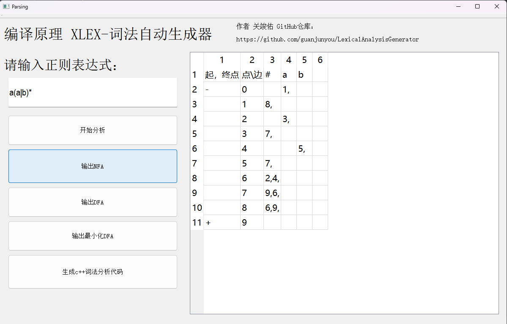
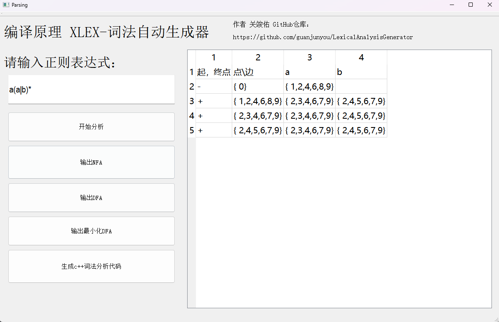
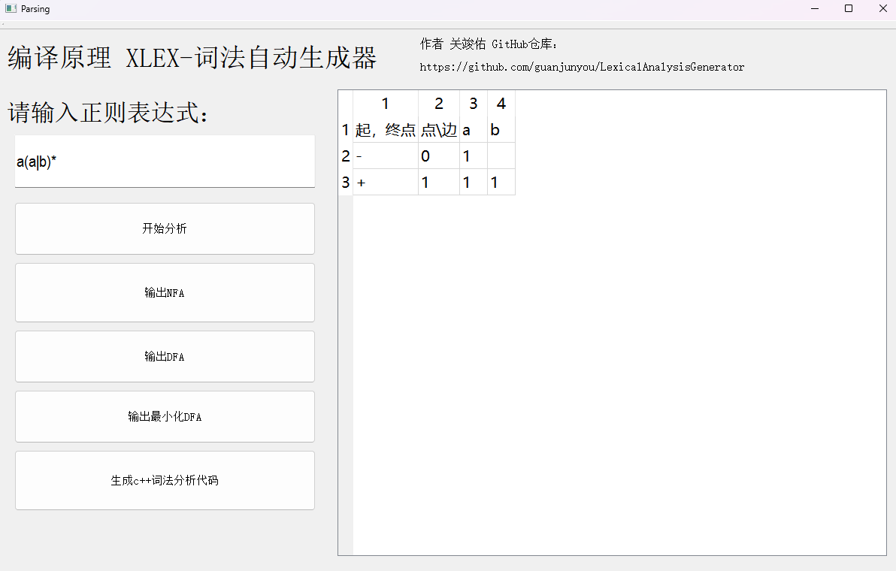
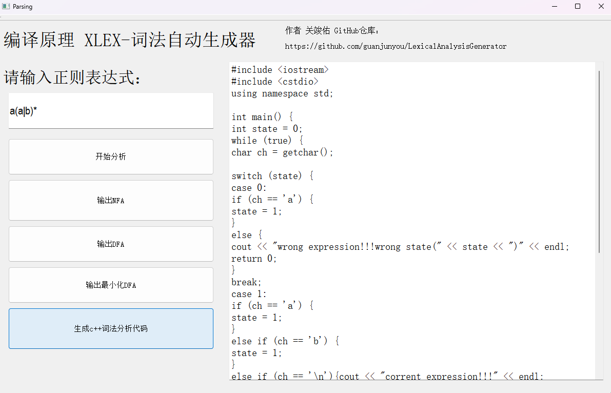

### 编译原理实验: XLEX-词法自动生成器

作者：华南师范大学 关竣佑

欢迎  star 

编译环境 Qt 4.3.0        需要放在英文路径下
**实现将正则表达式-->NFA--->DFA-->DFA最小化-->词法分析程序**

1. 正则表达式 **支持单个字符**，运算符号有： 连接（|）、选择、闭包（*）、括号（）、可选（?  ）、正闭包（+ ）

2. 用户输入一行（一个）或多行（多个）正则表达式（可保存、打开正则表达式文件）

3. 用户可以查看转换得到的NFA（用状态转换表呈现）

4. 用户可以查看转换得到的DFA（用状态转换表呈现）

5. 用户可以查看转换得到的词法分析程序（该分析程序用C++语言描述）

界面示意

